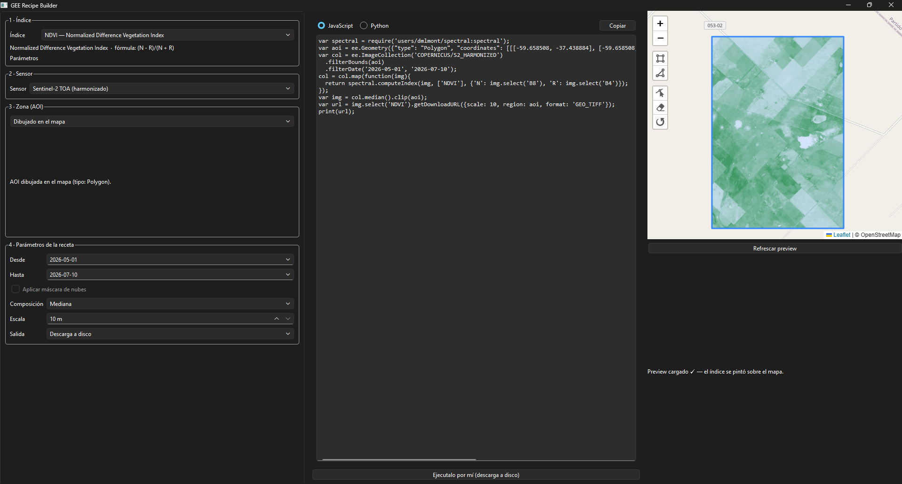

# gee-recipe-builder

> Build complete **Google Earth Engine** recipes from a guided form — no scripting required.

**gee-recipe-builder** is a desktop app that lets you build a full Earth Engine
recipe (spectral index → sensor → area of interest → date range → cloud mask →
composite → output) from an *index-first* form. It always shows you the
generated GEE script (JavaScript **or** Python, toggleable) and can optionally
run it for you — producing a GeoTIFF on disk, an export to Google Drive, or a
live preview on the map.

Earth Engine is powerful, but most of it is locked behind code. This tool aims
to open it up for people who know *what* they want to measure but not *how* to
write the script for it — agronomists, ecologists, students, anyone doing
remote sensing.

> ⚠️ **Status: early / alpha.** This is a first version, built solo, and there's
> still road ahead. The core works end-to-end; some features are still in
> progress (see [Status](#status)).

---



## What it does

- **Index-first workflow** — pick a spectral index, and the app tells you which
  sensors support it (derived from the bands each index needs vs. the bands each
  sensor provides).
- **Any index in the catalog** — vendored
  [awesome-spectral-indices](https://github.com/awesome-spectral-indices/awesome-spectral-indices)
  catalog, including kernel indices (kNDVI, kEVI, …).
- **Any optical sensor** supported by [eemont](https://github.com/davemlz/eemont)
  (Sentinel-2, Landsat 4–9, MODIS families).
- **Flexible area of interest** — load a shapefile (`.shp`/`.zip`), a GeoJSON,
  or type a bounding box.
- **Live script viewer** — see the generated JavaScript/Python update as you
  build the recipe, with a toggle between dialects. Copy it into the Code Editor,
  or let the app run it.
- **Run it for you** — synchronous download of a real `.tif` to disk, async
  export to Google Drive / Cloud Storage, or a live preview layer on the
  built-in interactive map.

## Status

| Capability | State |
|---|---|
| Domain core (index→sensor resolution, AOI parsing, JS/Python recipe compilation) | ✅ Done, covered by tests that don't touch GEE |
| GEE auth + synchronous `.tif` download | ✅ Works end-to-end |
| Qt UI (index-first form + live script viewer) | ✅ Functional |
| Interactive map (draw AOI + live index preview) | ✅ Done |
| Async export to Google Drive / Cloud Storage | ✅ Done |

The core "intent → script" translation is covered by golden tests that require
neither a GEE connection nor internet, so they run anywhere.

## Requirements

- Python **3.11+**
- A **Google Earth Engine** account and a Google Cloud project with the Earth
  Engine API enabled ([sign up](https://earthengine.google.com/)).

## Install

```bash
git clone https://github.com/CrashAMS/gee-recipe-builder.git
cd gee-recipe-builder
pip install -e .
```

## Run

```bash
python -m app
```

On first run the app walks you through Earth Engine authentication (OAuth in
your browser) and asks for your Cloud project id.

## Windows executable

If you'd rather not install Python, build a standalone Windows app — no
interpreter, no `pip install` on the target machine:

```bash
powershell -ExecutionPolicy Bypass -File packaging\build.ps1 -Zip
```

That produces `dist\gee-recipe-builder\gee-recipe-builder.exe`. Double-click it
to run. The `-Zip` flag also writes `dist\gee-recipe-builder-win64.zip`, ready
to hand to someone else — they unzip it anywhere and run the `.exe`.

Notes:

- **Ship the whole folder, not just the `.exe`.** It's a PyInstaller *onedir*
  build: the executable needs its sibling `_internal\` directory. This is
  deliberate — the interactive map runs on QtWebEngine, and a single-file build
  would re-extract ~500 MB of Chromium on every launch.
- **Size:** ~800 MB unpacked (~300 MB zipped), almost all of it Qt/Chromium.
- **Earth Engine auth is unchanged.** The build bundles no credentials; the
  first run still does the browser OAuth flow and stores the result in your
  user profile, exactly like the `python -m app` path.
- **Smoke test the binary** — verifies the frozen bundle can load the index
  catalog, the map assets and the GDAL stack:
  ```bash
  dist\gee-recipe-builder\gee-recipe-builder.exe --smoke
  ```
  Prints (and writes to `grb-smoke.log`) `SMOKE OK`, exit code 0.
- **If the `.exe` dies without a message,** rebuild with a console attached to
  see the traceback: `packaging\build.ps1 -Console`.
- Windows SmartScreen will warn on first launch — the binary isn't code-signed.

## Run the tests

```bash
pip install -e ".[dev]"
pytest tests/
```

The domain tests run offline — no GEE account needed.

## How it's built

`gee-recipe-builder` is intentionally a **thin layer** over mature open-source
libraries; it doesn't reimplement remote-sensing math. It stands on:

- [earthengine-api](https://github.com/google/earthengine-api) — the official GEE client
- [eemont](https://github.com/davemlz/eemont) — spectral indices, cloud masking, scaling
- [ee_extra](https://github.com/r-earthengine/ee_extra) — sensor/platform dispatch
- [awesome-spectral-indices](https://github.com/awesome-spectral-indices/awesome-spectral-indices) — the index catalog
- [PySide6](https://doc.qt.io/qtforpython/) — the desktop UI
- [GeoPandas](https://geopandas.org/) / [Shapely](https://shapely.readthedocs.io/) — AOI parsing

The layout separates a **pure domain layer** (`app/dominio/` — no GEE runtime,
no network) from **GEE integration** (`app/gee/`), the **UI** (`app/ui/`), and
the **interactive map** (`app/mapa/`).

## Contributing

This is a young project and feedback is very welcome — open an issue if you hit
a bug, want a sensor/index that isn't wired up yet, or have an idea. If you'd
like to contribute code, please open an issue first so we can align on scope.

## License

[MIT](LICENSE) © Álvaro Morales
